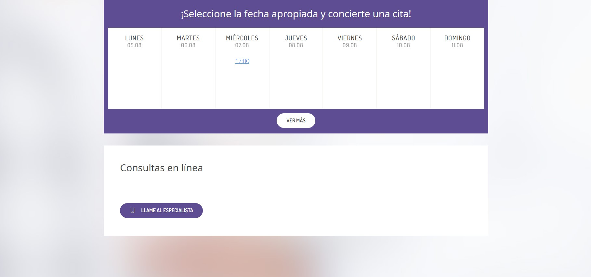
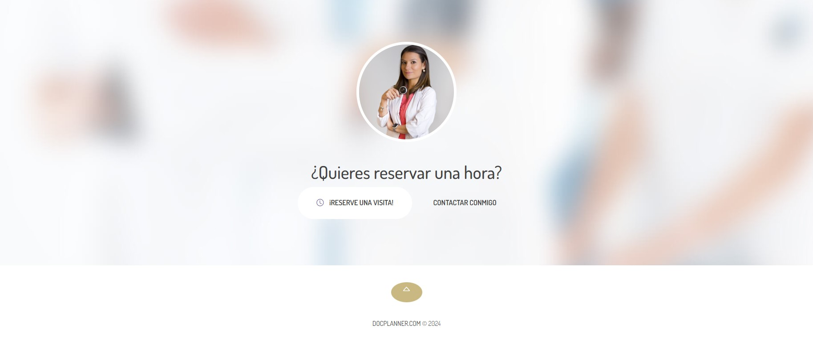

# Creación de página web de empresa

Descripción del Proyecto:

Este proyecto fue realizado para mostrar y poner en práctica las habilidades adquiridas durante el bootcamp de frontend developer.

## Tecnologías Utilizadas

* HTML: Para la estructura y el contenido de la página.
* CSS: Para el diseño y el estilo visual.
* Bootstrap: Framework de UI para el diseño responsivo y la creación de componentes de interfaz de usuario.

## Secciones del sitio web

